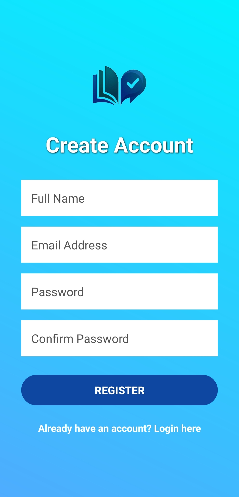
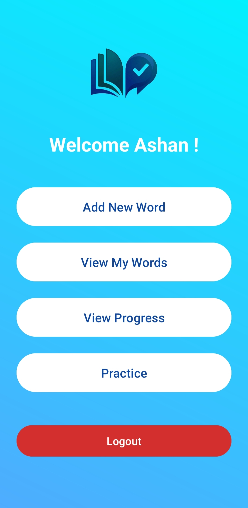
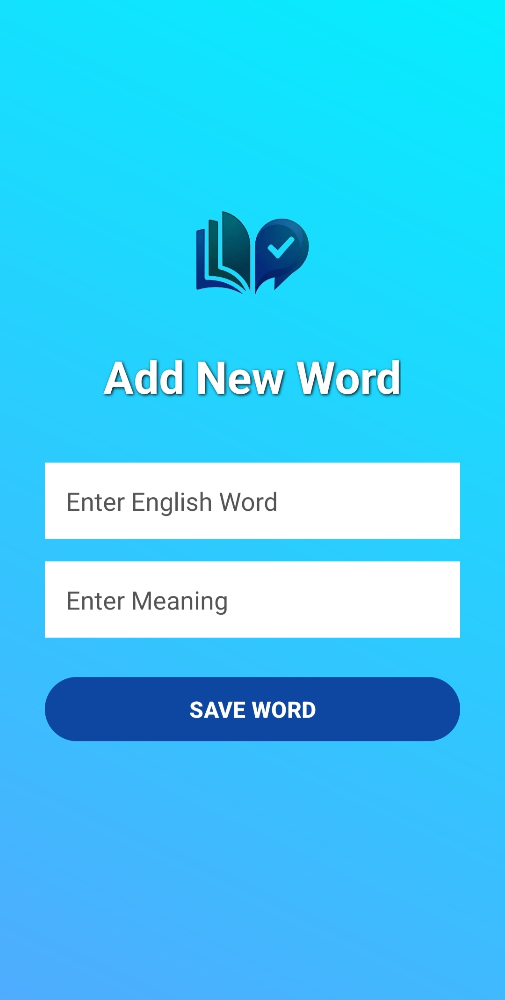
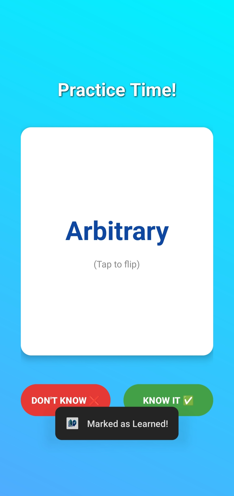
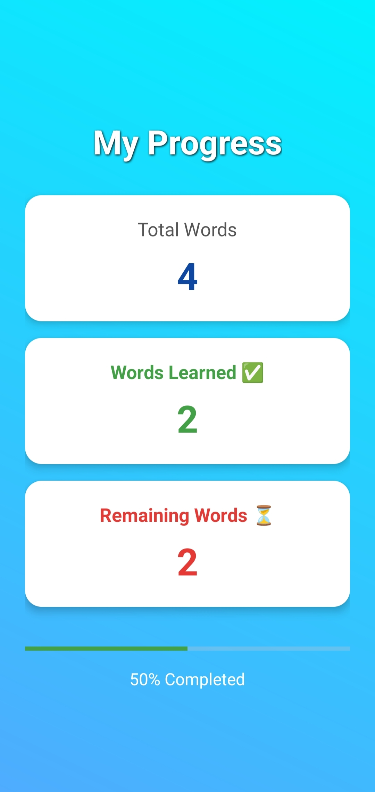
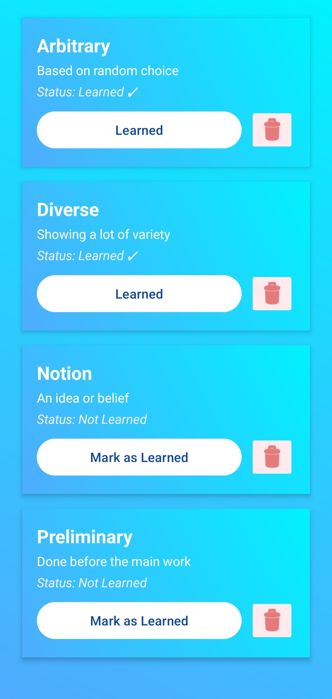

# WordWise - Vocabulary Learning & Practicing App 📚📱

## 📌 Project Description
**WordWise** is an interactive Android mobile application developed for the Mobile Application Development module. The primary goal of this application is to help users efficiently learn, practice, and retain new English vocabulary. The app allows users to add new words with their meanings, test their memory using interactive flashcards, and track their learning progress over time. 

The system utilizes an intuitive user interface and a local SQLite database to provide a seamless educational experience.

## 🚀 Features
* **Interactive Flashcards:** Users can test their memory with flip-animated flashcards and categorize words as "Know It ✅" or "Don't Know ❌".
* **Vocabulary Management:** Add and store new English words along with their native meanings locally.
* **Progress Tracking:** A dedicated statistics screen to visually track the total words added, learned words, and remaining words using progress bars.
* **User Authentication:** Secure user registration and login functionalities.
* **Modern UI/UX:** A clean, responsive, and aesthetically pleasing interface built with custom Android XML drawables and Material Design principles.

## 🛠️ Technologies Used
* **Programming Language:** Java (Android SDK)
* **Markup Language:** XML (For UI Layouts & Animations)
* **Database & Backend:** SQLite Database (Local Storage)
* **IDE:** Android Studio
* **Version Control:** Git & GitHub

## 📱 App Screenshots

  
  
  
  

 

  
  
  

## 👥 Team Member Details

| Index No | Registration No | Name | Role & Responsibilities |
| :--- | :--- | :--- | :--- |
| 5694 | ICT/2022/090 | Abdul Wadood Wasma | **Authentication & Security:** User Registration, Login System, and Authentication using SQLite |
| 5695 | ICT/2022/092 | MNFN. Rihani | **Database & vocabulary management:** SQLite integration, saving and retrieving vocabulary data |
| 5696 | ICT/2022/093 | A.K.A. Sanjula | **Flash Card & Practice:** App Design, XML Layouts, Flashcard Animation & Progress Logic |

---
📘 *This project is submitted in partial fulfillment of the requirements for the Mobile Application Development module.*
